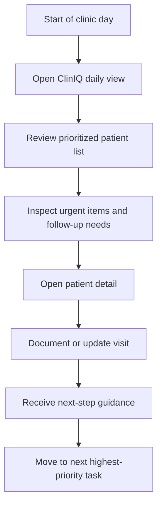
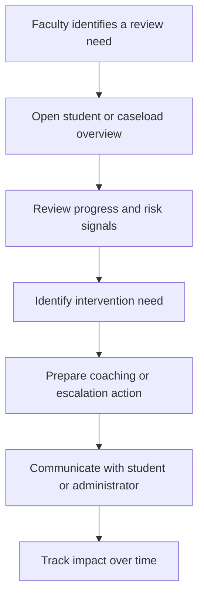
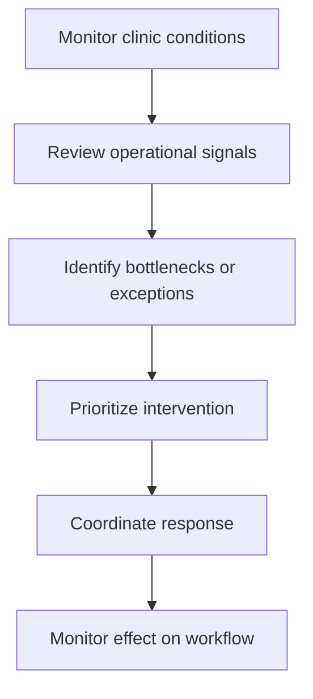
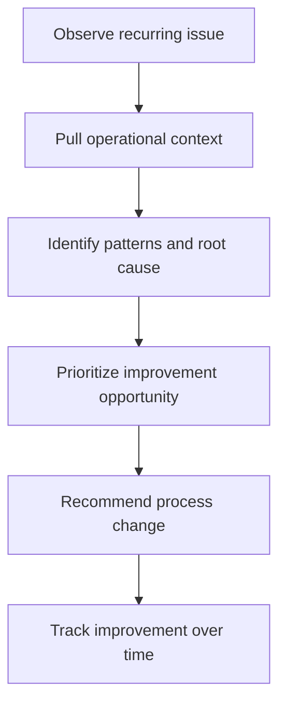
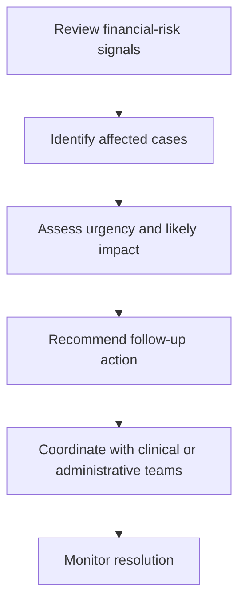
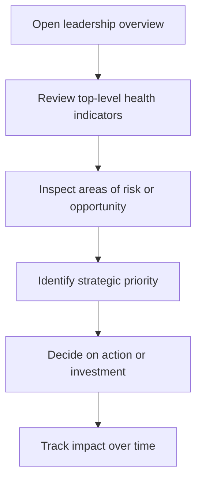

# User Journeys

These journeys describe the ideal experience for each major user group. They are designed to focus on user goals, decision points, friction, and the opportunities where AI could reduce cognitive load.

## 1. Dental Student Journey: Daily Case Prioritization

### Starting point
A student opens ClinIQ at the start of the clinic day.

### Goals
- Understand what requires attention first
- Quickly review patients who need follow-up
- Prepare for the day with minimal effort

### Current pain points
- The day begins with too much context switching
- Important tasks can be hard to identify quickly
- Students may spend valuable time reconstructing patient state

### Opportunities for AI
- Summarize patient urgency and recent activity
- Recommend the next best action for each patient
- Highlight likely follow-up needs based on visit history and treatment state

### Operational bottlenecks
- High caseload volume
- Inconsistent documentation quality
- Uneven follow-up discipline across patients

### Decisions they must make
- Which patient to see first
- What needs follow-up today
- Whether a case is progressing as expected

### Information they need
- Current patient status
- Urgent items and pending work
- Next best actions and likely risks

### Desired end state
The student opens ClinIQ and immediately understands what matters most for the day.

---

## 2. Faculty Member Journey: Coaching and Oversight

### Starting point
A faculty member reviews student activity or receives a signal that a student may need support.

### Goals
- Identify students who need guidance
- Understand whether work is progressing appropriately
- Spend less time on manual review and more time on meaningful intervention

### Current pain points
- Oversight is reactive and inconsistent
- Faculty may need to gather context from multiple places
- It is hard to see the difference between normal variation and a real problem

### Opportunities for AI
- Summarize student progress and risk areas
- Highlight students who may require intervention
- Explain why a case should receive attention

### Operational bottlenecks
- Limited faculty time
- Inconsistent visibility into student workflow
- High volume of cases and limited review bandwidth

### Decisions they must make
- Which students need follow-up
- Whether a case is a coaching issue or an operational issue
- Where intervention will have the greatest impact

### Information they need
- Student workload and pattern of activity
- Risk signals and incomplete tasks
- Recent updates or escalating issues

### Desired end state
Faculty can review student needs quickly and focus on coaching rather than administration.

---

## 3. Clinical Administrator Journey: Managing Clinic Flow

### Starting point
A clinical administrator monitors the clinic for congestion, delays, or unresolved work.

### Goals
- Keep the clinic moving smoothly
- Reduce friction that affects throughput
- Resolve problems before they expand

### Current pain points
- Problems often become visible only after they impact workflow
- Manual coordination is time-consuming
- Operational issues are not always obvious until it is too late

### Opportunities for AI
- Detect likely bottlenecks and suggest intervention points
- Surface cases that may be delaying the flow of work
- Prioritize what needs immediate operational attention

### Operational bottlenecks
- Uneven coordination across teams
- Delays in follow-up on pending issues
- Workflow congestion from incomplete or delayed actions

### Decisions they must make
- Which issue deserves attention first
- Whether staffing or scheduling support is needed
- Whether an escalation should be triggered

### Information they need
- Open bottlenecks and exceptions
- Workload pressure and pending tasks
- A trusted view of the current clinic state

### Desired end state
The administrator can see what needs intervention at a glance and respond earlier.

---

## 4. Operations Team Journey: Improving the System

### Starting point
The operations team identifies a recurring pattern or service issue.

### Goals
- Understand the root cause of workflow friction
- Design better operating processes
- Improve consistency and throughput over time

### Current pain points
- Data is fragmented and hard to interpret
- Improvement work is often based on partial information
- Trends are hard to see in real time

### Opportunities for AI
- Summarize recurring bottlenecks and patterns
- Highlight likely process failures or high-friction points
- Translate everyday activity into operational insight

### Operational bottlenecks
- Lack of clear, persistent operational visibility
- Limited ability to compare patterns over time
- Manual reporting overhead

### Decisions they must make
- Whether a problem is systemic or isolated
- Where process redesign should happen
- Which intervention will have the highest leverage

### Information they need
- Trends, anomalies, and recurring issues
- Process health indicators
- Cross-functional impact of operational friction

### Desired end state
The operations team can move from reactive reporting to proactive system improvement.

---

## 5. Financial Manager Journey: Protecting Revenue Readiness

### Starting point
A financial manager reviews cases that may create downstream delays or risk.

### Goals
- Reduce avoidable delays and leakage
- Identify cases that need intervention
- Maintain better visibility into financial readiness

### Current pain points
- Financial signals are delayed or difficult to see within clinical work
- Important cases may not be recognized until they become a bigger issue

### Opportunities for AI
- Identify cases with elevated financial or administrative risk
- Surface likely blockers ahead of time
- Recommend where follow-up will have the most value

### Operational bottlenecks
- Incomplete workflows
- Documentation lag
- Delayed case progression

### Decisions they must make
- Which cases need attention immediately
- Where financial risk is increasing
- Whether action is likely to improve downstream readiness

### Information they need
- Case status, pending items, and risk indicators
- Connection between clinical progress and downstream financial impact

### Desired end state
Financial risk becomes visible earlier, and interventions are more targeted and efficient.

---

## 6. Executive Leadership Journey: Strategic Oversight

### Starting point
Leadership reviews the current state of the clinical environment or a specific performance theme.

### Goals
- Quickly understand what is going well and where pressure is building
- Make strategic decisions with confidence
- Focus attention on the most important issues

### Current pain points
- Aggregated reporting may be too abstract or delayed
- The connection between daily workflow and strategic outcome is not always clear

### Opportunities for AI
- Summarize operational performance in a succinct and trustworthy way
- Highlight emerging issues and explain their significance
- Surface opportunities that deserve leadership attention

### Operational bottlenecks
- Complex environment with many moving parts
- Limited time for interpretation and synthesis

### Decisions they must make
- Where to invest attention or resources
- Which themes require intervention now
- What outcomes should shape the next planning cycle

### Information they need
- A concise picture of performance and risk
- Clear explanation of what matters most right now
- Confidence that summaries reflect real operational reality

### Desired end state
Leadership can understand the state of the system quickly and act with greater clarity.

